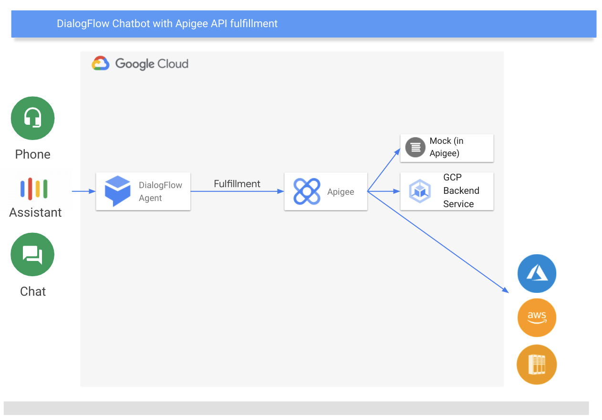

# Apigee DialogFlow CX Quickstart

This guide is to show how to quickly kickstart a DialogFlow webhook in Apigee, which can be particularly useful if you are already proxying your backend systems to APIs in Apigee, or want just want to reduce the dependencies and complexity from your DialogFlow chatbots to your backend systems.

# Architecture

In this simple example, we have an agent deployed in DialogFlow CX, which is connected to an Apigee API as fulfillment for requests about the factory equipment status.

The API here is just using a mock + some javascript logic to generate some fake status information.  However as a next step it would be easy to connect it to real backend services, either in GCP, or in other clouds / on-premise.

# Deployment instructions

1. Download the proxy ZIP file from the /proxy directory
2. Import the proxy zip into either an eval or normal apigee environment (regardless if public, private or hybrid cloud versions)
3. Deploy the proxy and copy the URL + "/df" as the URL to add into DialogFlow CX as webhook
4. Test your chatbot in DialogFlow, and see how the testdata from the proxy is used in the chatbot.
5. Customize and adapt as needed :)

